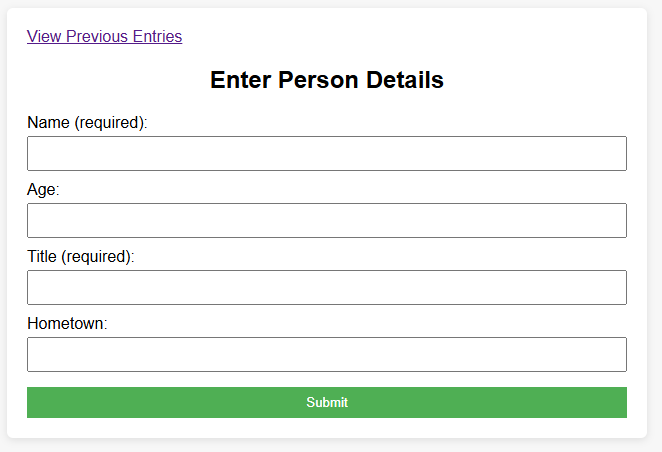
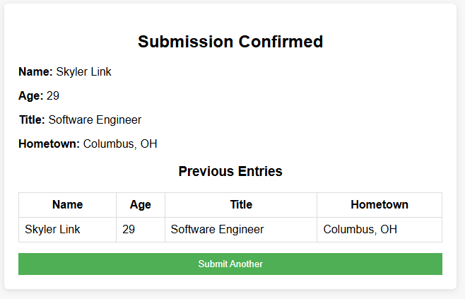

# OLISApp
### This is an application to satisfy the requirements of the Ohio Legislative Information Systems code screening excercise for the Software Engineer position.

## How to run
This application leverages the H2 Database dependency to enable an embedded, in-memory database. This eases setup and allows us to get up and running faster.
1. Download and install Java 17 from [Oracle](https://www.oracle.com/java/technologies/javase/jdk17-archive-downloads.html)
2. Download the latest .jar file from the [releases page](https://github.com/skylerlink/OLISApp/releases)
3. Open a terminal, navigate to the directory the .jar file is in and run: `java -jar OLISApp-0.0.1.jar`
   - Example screenshot from Windows of how to navigate to the directory you downloaded the .jar to and execute the command to run the jar 

5. Visit http://localhost:8080 in your browser

## Screenshots
### Submit page

### Confirmation page / previous entries

